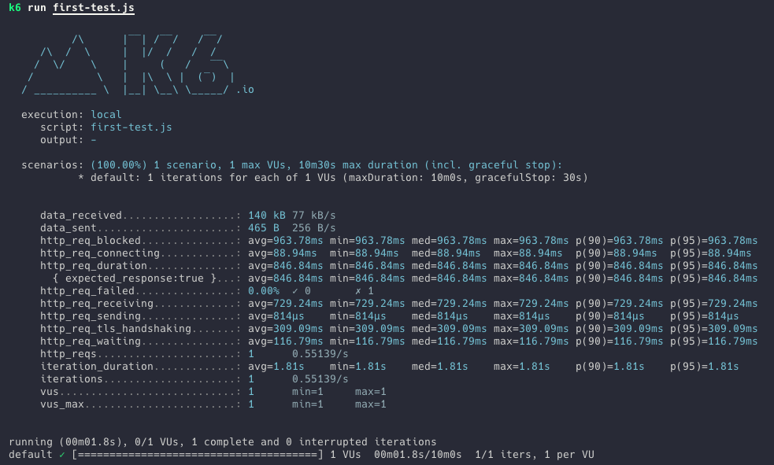
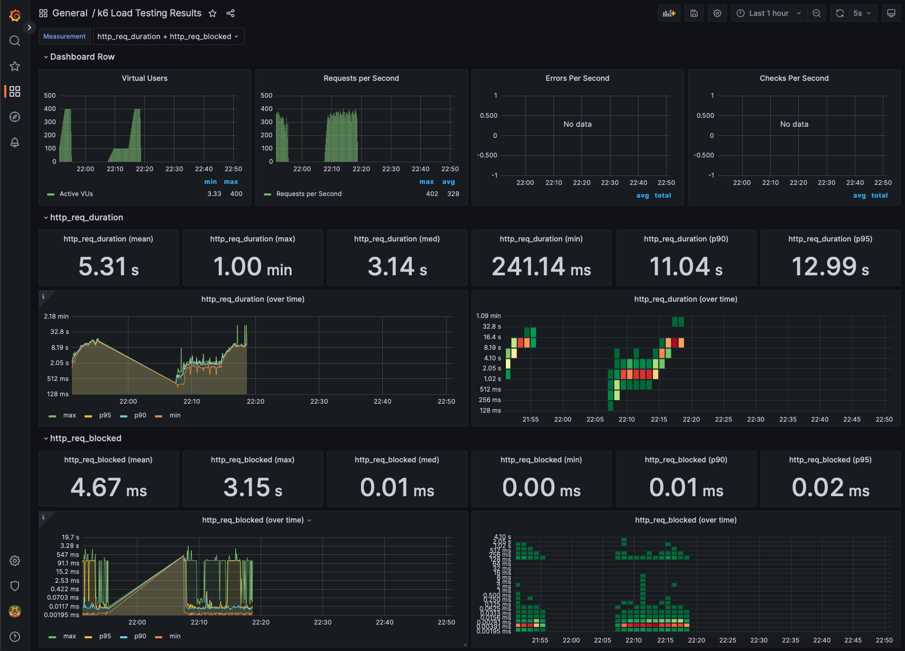

Performance Test
===============

This repository have content of course [Curso de performace Testing en Node.js con K6](https://platzi.com/cursos/performance-testing-nodejs/)



> This repository using next [api FakeApi Platzi](https://fakeapi.platzi.com/)

## Run Test

```console
docker pull grafana/k6
docker run --rm -i grafana/k6 run --vus 10 --duration 30s - < first-test.js
```

## Content

* [First Test ](./first-test.js) 
* [Stages](./stages.js) This test using VUs and stages, run test with 10 user in 10s.
* [Smoke](/smoke.js) The smoke test is test with few users.
* [Stress](./stress.js) The stress test is test with maximum amount of users and requests.
* [Spike](./spike.js) The spike test is a test that increases the number of users in a short time..
* [Load](./load.js) The load test is a test that we have a high average number of users and spontaneous users increase.
* [Soak](./soak.js) The soke test is a test that we have a low number of users but for a long time.

## Custom Metrics
* [Counter Metric](./counter.js) Custom metric with accumulate value
* [Gauge Metric](./gauge.js) Save minimum, maximum and last values
* [Rate Metric](./rate.js) Save percentage when not is zero.   
* [Trend Metric](./trend.js) Result statistics values.

## Checks and Thresholds
* [Check](./check.js) Checks is validations in us test. Not break the test.
* [Threshold](./threshold.js) Checks is validations in us test. that break the test.


## Dashboard

1. Create network for communication into containers
```console
docker network create k6-dashboard
```
2. Create containers into network 
```console
docker run -d --name=influxdb -p 8086:8086 -v "$(pwd)/data_test:/var/lib/influxdb" --network=k6-dashboard influxdb:1.8

docker run -d --name=grafana -p 3001:3000 --network=k6-dashboard grafana/grafana-oss
```
3. Run test and send data to influxdb
```console
k6 run --out influxdb=http://localhost:8086/k6dbtest stress.js
```
3. Add data source (influxdb) in grafana

> using url with name container influxdb: http://influxdb:8086 and database k6dbtest

3. Import dashboard with id
Reference : https://grafana.com/grafana/dashboards/?search=k6